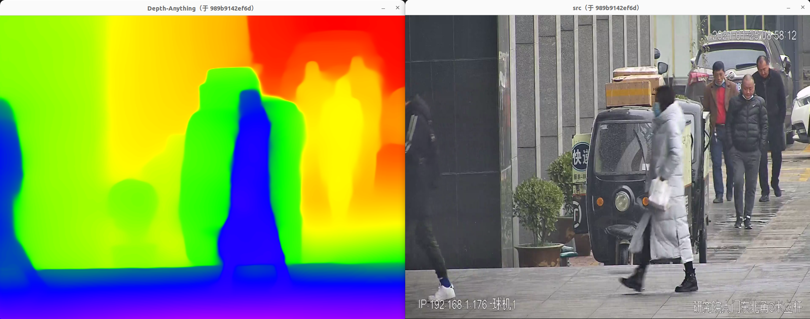
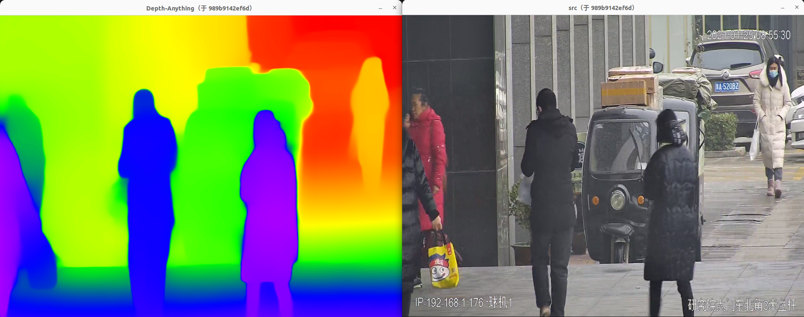
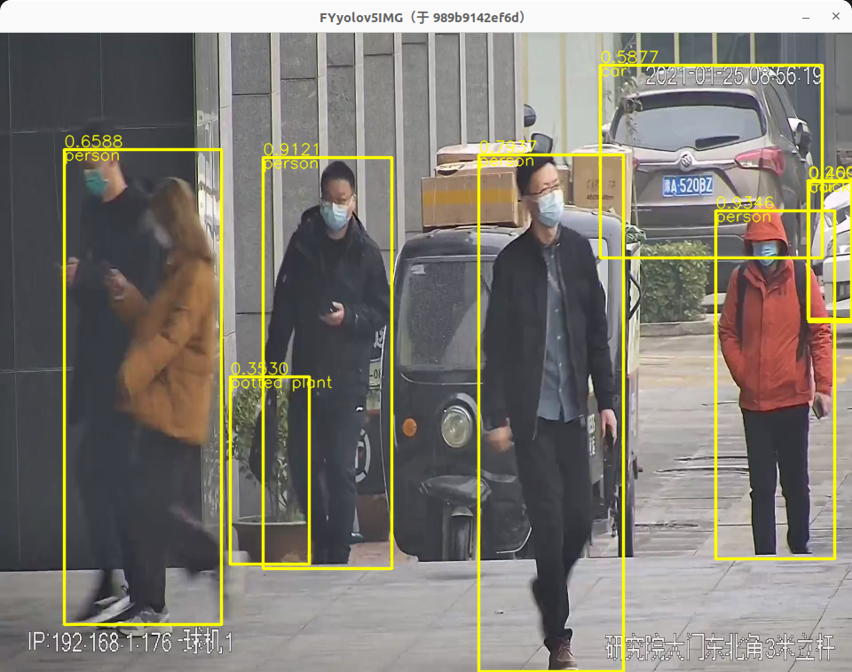
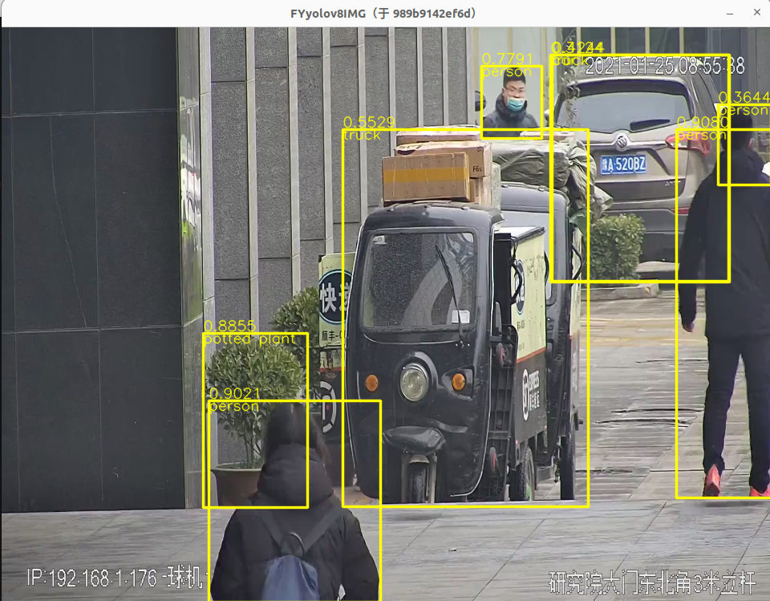
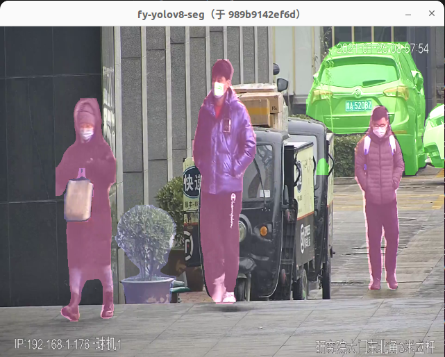
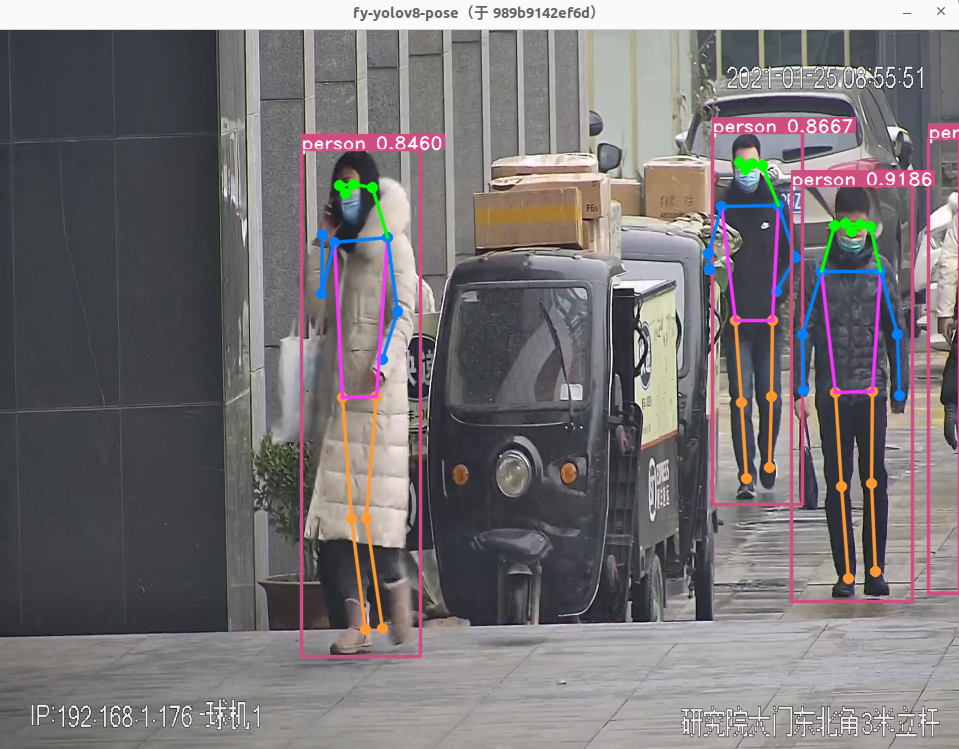

# video_detection


#### 通过配置参数实现不同算法,封装的算法有：yolo系列检测、分割、关键点、DepthAnything单目深度估计，结果展示：
<!-- <p align = "left">     -->
<p align = "center"> 






</p>


#### 介绍
软件集成：解码、回调、检测、通信模块
软件目的：是通过配置文件方便切换解码、检测、通信的随意组和，以适配不同情况的使用。
#### 软件架构
```
1、海康sdk解码、海康sdk Capture图片、ffmpeg cpu解码 三种方式获取RTSP视频流图像，可以通过配置拉取多路视频；
2、支持opencv读取视频文件、usb摄像头、文件夹三种方式获取本地图像；
3、通过std::bind std::std::function 实现函数回调，在类之间完成图片数据传递；及多线程处理
4、封装FY版本、WX版本 yolo系列；封装yolo检测、分割、关键点，DepthAnything单目深度估计
```

#### 后续规划
```
1、如何设计软件架构方便模块间切换；设计参数类、回调类；
2、检测：可以添加其他检测：如人脸检测、分割、OCR等；目标跟踪、关键点等
3、解码：可以添加硬解码相关操作；
```

#### 安装教程

#####  参考记录
```
DepthAnything单目深度估计: https://github.com/LiheYoung/Depth-Anything
FeiYull版本：https://github.com/FeiYull/TensorRT-Alpha
wang-xinyu版本 https://github.com/wang-xinyu

FY版本通过ONNX到 tensorRT 的c++封装好，可以直接在类里面使用；测试其速度在 8-10ms（F32 yolov5s 3080ti 960*720）
WX版本直接调用 tensorRT 的API的c++封装差，不能封装到c++的类里面；测试其速度在 5ms（F32 yolov5s 3080ti 960*720）

FY版本的代码可以实现yolov4-yolov8的全部转换部署
WX版本yolov4-yolov7版本及分割

FY版本在转换yolov5.6.0 时需要使用 alpha_edit.py 转换
python alpha_edit.py --mode=p5 --net_name=yolov5s  --model_path=../data/yolov5/yolov5s.onnx


yolo export --model=yolov8s-seg.pt --format=onnx opset=12
yolo export --model=yolov8s-pose.pt --format=onnx opset=12


conda activate yolov8 
python ./export.py --weights './yolov5s.pt' --img 640 --batch 1 --include onnx
python ./export.py --weights './yolov5s-seg.pt' --img 640 --batch 1 --include onnx


/dev/shm/TensorRT-8.6.1.6/targets/x86_64-linux-gnu/bin/trtexec --onnx=yolov5s-seg.onnx --saveEngine=yolov5s-seg.trt
/dev/shm/TensorRT-8.6.1.6/targets/x86_64-linux-gnu/bin/trtexec --onnx=yolov8s-seg.onnx --saveEngine=yolov8s-seg.trt

/dev/shm/TensorRT-8.6.1.6/targets/x86_64-linux-gnu/bin/trtexec --onnx=yolov8s-pose.onnx --saveEngine=yolov8s-pose.trt --fp16
```

##### FFmpeg 安装
```
支持ffmpeg4.3和ffmpeg4.4
apt update && apt install
apt-get install build-essential
apt-get install libgtk2.0-dev pkg-config libavcodec-dev libavformat-dev libswscale-dev
apt-get install python-dev python-numpy libtbb2 libtbb-dev libjpeg-dev libpng-dev libtiff-dev libjasper-dev libdc1394-22-dev

sudo apt-get install yasm
sudo apt-get install nasm
 wget http://ffmpeg.org/releases/ffmpeg-4.3.1.tar.xz
xz -d ffmpeg-4.3.1.tar.xz
tar xvf ffmpeg-4.3.1.tar
cd ffmpeg-4.3.1
./configure --enable-swscale --enable-swresample --enable-gpl --enable-shared

./configure --prefix=/dev/shm/ffmpeg4.4_bin --enable-swscale --enable-swresample --enable-gpl --enable-shared

./configure --prefix=/usr/local/ffmpeg --enable-gpl --enable-nonfree --enable-libfdk-aac --enable-libx264 --enable-libx265 --enable-filter=delogo --enable-debug --disable-optimizations --enable-libspeex --enable-shared --enable-pthreads --enable-indev=alsa --enable-outdev=alsa
make -j6
make install
export LD_LIBRARY_PATH=/dev/shm/ffmpeg4.4_bin:$LD_LIBRARY_PATH

```

#### 代码问题记录

##### log4cpp的 logger.h 与trensorRT的 logger.h 冲突问题

```
显现：expected unqualified-id before 'while' 错误
解决：通过引用头文件时#"../log4cplus/mylogger.h" 在引用tersorrt后面；
#include "ProApplyYolov8.h"
#include "../log4cplus/mylogger.h" 
```

##### 函数回调 问题1

```
现象： terminate called after throwing an instance of 'std::bad_function_call'
  what():  bad_function_call 错误
原因：异常std::bad_function_call在调用空的函数对象（std::function）时抛出。空的函数对象一般情况是未给函数对象赋值或赋值null。
解决：判断 m_callFun.operator bool() 为真即可
if(m_callFun.operator bool()){
    m_callFun(m_recver,img, img_path, image_time, camid);
}else{
    LOG_INFO("fs callable object not set, not callable");
}  
```

##### 函数回调 问题2 -----传递this指针时错误 待解决
```
每次m_recver->m_sender = std::bind(&ProcessApply::self, this); 
时当触发速度快 会出现错误
现在屏蔽以下代码解决；
m_recver->m_sender = std::bind(&ProcessApply::self, this);
m_callFun(m_recver,img, img_path, image_time, camid);
m_recver->m_sender = NULL;
```

#### vscode快捷键
```
Ctrl+upper+t  方法添加注释
Ctrl+upper+i  cpp添加注释

Ctrl+k+j   打开所有折叠
Ctrl+k+o   关闭所有折叠

git reset HEAD 后面什么都不跟的，就是上一次add 里面的内容全部撤销
git reset HEAD XXX 后面跟文件名，就是对某个文件进行撤销
```

#### git记录

```

git reset HEAD 后面什么都不跟的，就是上一次add 里面的内容全部撤销
git reset HEAD XXX 后面跟文件名，就是对某个文件进行撤销
git reset --hard
```
